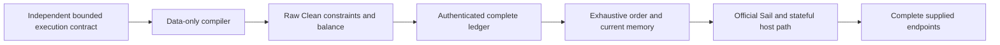

# Architecture

## Design rule

The stable verification boundary is a complete SP1 chip.

Rust operations and Lean gadgets may use different intermediate structures. A native Lean chip is
proved against a semantic contract, connected to Sail, and then compared with the complete upstream
chip assertion and interaction systems. Shared reader and operation extraction provides canonical
statement targets for the whole-chip oracles; the public verification boundary remains the chip.

This produces four distinct objects:

1. a proof-oriented native Clean circuit;
2. a semantic chip contract;
3. a complete extracted Rust AIR oracle; and
4. a Sail instruction-step theorem.

No one of these objects is silently treated as another.

That rule does not license duplicate *views* of the same object. The machine layer therefore has
two explicit strata and proved views at their boundary:

1. **Operational semantics:** `Model.Core.ExecutionPath` owns complete Sail/host/clock execution
   over the shared `Machine.ExecutionEvent` labels, with PolyFun and Sail views. The retained
   `Machine.EventExecutionTrace` serves the legacy ordinary/exact-Core relation; it does not carry
   the complete evolving host. `FormalModel/Shard.lean` states the new full-state contract.
2. **Physical AIR:** `DecodedInstructionRow`, `ChipRow`, and `RowView` retain dependent circuit
   types and field encodings. They are codecs for the physical witness, not competing execution
   models.

The completeness compiler also has **derived, field-free views**: `InstructionAccessPlan`,
`AccessSchedule`, `MemoryHistoryAccess`, and the State-history records.  They are deterministic
projections of execution, not a second execution witness. The existing ordinary compiler derives
these from `EventExecutionTrace`; its remaining physical-row agreements are named explicitly in
`NativeTraceReady`. Reuse those views when adapting to complete local paths, rather than adding a
parallel schedule or hiding readiness in the new semantic domain.

Instruction identity follows the same rule. `Model/InstructionChipId.lean` fixes the neutral
25-entry order; `Model/InstructionRouting.lean` owns the pure opcode/`x0` route; and
`Soundness/SupportedMachine.lean` is only the circuit-bearing realization of those identities.
Adding another opcode list or positional 25-chip literal is an architecture regression.

The interaction layer deliberately has **two** primary views because their information differs:

- typed `TypedInteraction`s for soundness, where a message retains its State/Memory/Program shape;
- computable `LookupAccess` ledgers for completeness, recounting, and integer balance.

`Interaction.toAccess`, lifted table/ensemble-wide, is their bridge. Clean orientation is canonical
inside the native model. The Memory/Program sign dualization used by extracted Rust faithfulness is
an explicit Rust-facing projection, never a second native ledger definition.

## Repository layers

### Model choices, reusable arguments, and implementation obligations

The full-state capstone has three review boundaries. A change must identify which one it affects:

| Boundary | Owns | Must not contain |
|---|---|---|
| Semantic contract | Official Sail retirement, the selected instruction/host policy, complete snapshots, ROM/write permissions, and semantic resource limits | Circuit rows, compiler success, provider validity, or grounding certificates as execution preconditions |
| Ensemble argument | Raw Clean ledger accounting, authentication, exhaustive ranked State order, Memory chronology, and complete-boundary composition | A second execution semantics or discarded physical interactions |
| Implementation obligations | Chip dispatch, field encodings, access plans, row population, and local arithmetic/bounds proofs | Undisclosed restrictions on the public execution language |



PolyFun owns machine/path vocabulary; Clean owns circuits, ensembles, and balance. Use their
existing interfaces and the additions in `ToPolyFun`/`ToClean`. Clean's `VmTables` result does not
expose the exhaustive ordered path needed here; its verifier-guarantee theorem is not a substitute
for the ranked State/Memory argument. Reusable additions must migrate a real consumer and state
their gap against the pinned upstream interface. SP1 schedules, physical codecs, and syscall
dispatch stay in the SP1 instance. An alternative RISC-V ensemble is a later consumer of the same
semantic contract, not a prerequisite for completing the current one.

The [coverage register](overview.md#coverage-register) distinguishes model exclusions from proof
debt. The [plug-in map](plugin-points.md) records the contracts consumed at each circuit boundary;
the [audit surface](audit-surface.md) records the definitions that determine the claim.

| Layer | Responsibility |
|---|---|
| `Math/` | field-generic words, carries, bit operations, and arithmetic lemmas |
| `Model/` | SP1 messages, channels, Sail state/execution, schedules, and syscall interfaces |
| `Extracted/` | generated Rust rows, assertion lists, interaction lists, manifest, and provenance |
| `FormalModel/` | semantic contracts and public witness relations |
| `Native/` | independent Clean circuits and witness-producing gadgets |
| `Proofs/` | circuit soundness/completeness and Sail bridges |
| `Faithful/` | whole-chip comparisons on canonical native rows reconstructed from extracted Rust rows |
| `Soundness/` | machine registry, typed decoding, grounding, and capstones |
| `Composition/` | the composed exact→native artifact: transport, provider redistribution, the 55-table assembly |
| `ToPolyFun/` (top-level library) | upstream-destined PolyFun lemmas: orbit composition and labeled traces (`Labeled.Trace`) |
| `ToClean/Air/Realizes.lean` | `Air.Flat.Realizes`, a Clean ensemble realizing a PolyFun `Labeled` machine; `SP1Clean` instantiates it |
| `SP1CleanTest/` | compiler-trusted executable conformance tests, isolated from the main library |

`SP1Clean.lean` imports the complete main proof library (`scripts/check_root_index.sh` gates that it
lists every module). The test library imports it in the opposite direction and is never part of the
main theorem graph.

## Deliberate layering exceptions

Layering is by convention, and four exceptions to it are design decisions rather than drift. An
auditor should expect exactly these:

1. **Three chips keep `main` in `Proofs/`.** `DivRemChip`, `ShiftLeftChip`, and `ShiftRightChip`
   define `main` + `elaborated` in `Proofs/Chips/<X>Chip/Defs.lean` rather than `Native/Chips/`,
   because their mains are entangled with proof-layer decomposition modules (DivRem imports
   `Proofs/Operations/DivRemOperation/{Compare,Core}` and its own `Populate`; the shifts import
   their `Core`/`Populate`/`Dispatch`/`Math`/`Flags` families). Moving the file without moving the
   decomposition would make `Native/` import `Proofs/` — worse than the exception. The public chip
   boundary (one `main`, one `Spec`, `circuit` bundle) is unaffected.

2. **Chip `Spec` locations.** The complete inventory:

   | Location | Chips |
   |---|---|
   | `FormalModel/Contracts/Chips.lean` (13) | Add, Addi, Addw, Sub, Subw, Mul, UType, Jal, Jalr, Branch, DivRem, ShiftLeft, ShiftRight |
   | `Native/Chips/<X>Chip/Defs.lean` (10) | AluX0, LoadByte, LoadHalf, LoadWord, LoadDouble, LoadX0, StoreByte, StoreHalf, StoreWord, StoreDouble |
   | `Proofs/Chips/<X>Chip/Formal.lean` (2) | Lt, Bitwise (deliberately split `Spec`s) |

   The memory/x0 chips' contract blocks (`Inputs` + `Spec`) are Native-resident; homing them onto
   the Contracts surface is the "Spec homing" backlog item (`docs/roadmap.md`) — chip `Spec`s are
   performance-sensitive (the folded-hypothesis doctrine), so the moves are deliberate, measured
   work, not a rename sweep.

3. **`Assumptions`/`ProverAssumptions` locations.** Six chips (Add, Addi, Addw, Sub, Subw, UType)
   have theirs on `FormalModel/Contracts/ChipAssumptions.lean`; the rest stay in proof files for
   one of the two structural reasons stated in that file's module docstring (hint/helper-dependent
   preconditions, or a Native-resident contract block per item 2).

4. **Two time vocabularies, one engine.** The timed grounding walk is duration-generic
   (`TimedGrounding.walkT` over a `Semantics.Timeline` — the bus clock at the start of each
   semantic step, windows at least eight ticks wide), so mixed ordinary/syscall (8/264-tick)
   walks are expressible; the ordinary walk is literally its `Timeline.ordinary` instantiation
   through the `…_ordinary` bridges (`microValueT_ordinary` down to `groundedT_ordinary`).  What
   remains deliberately dual is the *vocabulary*: the fixed eight-tick micro-time layer
   (`Model/Semantics/MicroTime.lean` — `ordinaryClkInc`/`ramEffectOffset`/`regEffectOffset`, the
   Rust `CLK_INC`/`MemoryAccessPosition` constants) is what the per-chip layers speak and prove,
   while complete local execution uses event durations. `CoreExecutionTrajectory` proves the
   mixed replay's agreement with the AIR timeline. The legacy scheduled corollary retains its
   `Machine.SP1MachineModel.schedule`/`UsesOrdinarySchedule` view; it is not a separate clock
   assumption in the new full-state contract.

## One instruction chip

For each supported chip, the verification chain is:

```text
native Clean main
  ├─ circuit soundness ──→ semantic chip Spec
  ├─ circuit completeness
  ├─ Sail bridge ────────→ one official try_step transition
  └─ row codec
       └─ ChipFaithful ──→ complete Rust assertions + active interactions
```

### Native circuit and contract

`Native/Chips/<Chip>/Defs.lean` owns one native row type and one `main`. It composes readers and
arithmetic gadgets as true Clean subcircuits. Public semantic meaning lives under
`FormalModel/Contracts/`; it is not a restatement of the generated constraint list.

`Proofs/Chips/<Chip>/Formal.lean`, or a focused submodule for a large chip, proves:

- soundness: satisfying the circuit entails the semantic contract; and
- completeness: the honest witness closures satisfy the circuit under the stated prover inputs.

All 25 registered instruction circuits now have closed soundness and completeness proofs.

### Sail bridge

`Alignment/Chips/<Chip>/Bridge.lean` turns the semantic contract into the corresponding behavior of the
generated LeanRV64D Sail model. `ChipKind.advance` packages the result in the uniform interface used by
the machine proof.

The bridge is conditional on concrete decoded operands and the live machine state. Those facts are
derived by the grounding engine, not assumed by the chip's row-local channel predicates.

### Whole-chip Rust faithfulness

The extractor emits:

- the exact upstream Rust row type;
- every `assertZero` expression in order; and
- every interaction expression in order.

`Faithful/ChipOracle.lean` defines an explicit bijective row-layout codec. `ChipFaithful` proves:

```text
upstream assertions hold
  ↔ native Clean component constraints hold
```

and, on accepted rows:

```text
active upstream interactions
  = active native interactions, as a multiset
```

Zero-multiplicity entries are observationally absent from both LogUp and Clean balance. Native
interactions on an unexpected fifth channel are retained in the comparison, so a proof cannot make one
disappear by checking only the four expected buses.

`Faithful/SupportedMachine.lean` contains one proof-bearing entry for every descriptor and proves that
its table tags are exactly the 25 upstream instruction tables. This is the coverage tripwire for future
pin or registry changes.

The two bump system tables carry the same whole-table comparison in `Faithful/StateBumpChip.lean` and
`Faithful/MemoryBumpChip.lean`, against `Extracted/SystemOracle/{StateBump,MemoryBump}.lean`. Both are
flat own-assert tables with `localLength = 0`, so their native row is the chip `Inputs` and the row
codec is the input-first physical row; the `ChipFaithful` structure itself is keyed on a circuit's
*output* type map, which for these tables is `unit`, so each anchor states that structure's two
clauses directly against `⟨StateBumpChip.circuit⟩` / `⟨MemoryBumpChip.circuit⟩`. They are not part of
the 25-entry instruction coverage certificate.

## The native supported machine

The native shard capstone targets arbitrary bounded local paths, with complete incoming and
outgoing Sail/host states. `FormalModel/Shard.lean` fixes the execution spine;
`Soundness/Shard/Contract.lean` gives checked AIR soundness and constructive-compiler target types
using the existing `CompleteEnsemble` and `EnsembleCompiler`. The concrete resource profile and
instances remain open. Current progress and implementation order are maintained in the
[fork campaign issues](https://github.com/dtumad/sp1-lean/issues); [the roadmap](roadmap.md)
records the durable contract and acceptance gates.

### Semantic ownership

`Model/Core/Execution.lean` defines one step through the official Sail state, concrete host state,
and clock. `ExecutionPath` composes those steps and supplies split/join and PolyFun equivalence;
`ExecutionReplay` reconstructs the same path with actual host effects. Ordinary execution retires
normally in eight ticks; each host call takes 264 ticks. HALT is an actual transition that sets
host exit status. A stopped source permits only an empty identity. Padding never becomes a step.
`ExecutionBoot` specializes the same semantics at boot/HALT endpoints.

`Model/Semantics/SailStepReduction`, `SailFetch`, and `SailRetirement` own the circuit-independent
official-Sail reduction, fetch, configuration-transport, and retirement-tail lemmas. Their existing
namespaces are retained, and `Proofs/Sail/Advance` consumes them to construct chip row effects.
`Model/Core/InstructionFetch` applies actual fetch agreement at checked finite boundaries without
importing chip rows. This does not yet prove configuration or ROM preservation for every arbitrary
supported semantic step; those laws must consume normal retirement and decoded write permission.

`ExecutionSnapshot` is the finite representation of the whole boundary: every Sail register and
its presence, sparse RAM, runtime counter/output, complete host state, and clock. Its executable
comparison is proved equivalent to literal equality of realized states. `MemorySnapshot` is only
the provider projection of register/RAM values; it is not a complete boundary. `HostSnapshot`
executes concrete host calls on the finite representation and proves full-state agreement with
the Sail adapter, including padded writes. An executable finite ordinary compiler remains work.

The legacy `Model/Machine/EventExecutionTrace` and `CoreShardSemanticWitness` still serve the
55-table ordinary compiler and exact-Core relations. They do not thread the complete evolving
host. They are compatibility views, not an alternative definition of the full-state capstone.
Adapters must state what they preserve; no equivalence is assumed merely from similar names.

### Assembly and proof ownership

| Layer | Role |
|---|---|
| `LocalCore.ensemble` | Checked complete source, fixed Program ROM, ordered register/RAM boundary providers, source/public PC/clock binding |
| `ProtectedLocalCore.ensemble` | Ordinary store wrappers and fixed writable-byte permission provider, preserving the original chip constraints and old ledgers |
| `HostLocalCore.ensemble` | Full-code syscall wrapper and extensible physical handler/resource tables |
| `HostHintReadLocal` / `HostHintQueueBoundary` | Installed source-hint handlers, word consumers, verifier-owned queue and bank endpoints |
| `CoreTableProjection`, `CoreRowBalance`, `CoreMemoryBalance` | Shared physical table projections and complete occurrence accounting |
| `StateChronology`, `CoreMemoryChronology`, `CoreRowTransport` | Order, refresh elimination and the shared `ExecutionCarrier`; native, local and host `GroundingCarrier` names are instance abbreviations |
| `CoreExecutionTrajectory` | Actual paired replay and alignment with the AIR timeline |
| `HostHintReadExecutionPath` / `HostHintReadFinalMemory` | Installed mixed-AIR path with final PC/clock, all native register/RAM values, complete RAM domain, all Sail bookkeeping observations and host reconstruction |
| `Model/Core/SailBookkeeping` / `HostHintReadBookkeeping` | Source-controlled retirement count and final nextPC from the existing semantic tape, connected to actual grounded chip effects |
| `CoreMemoryFrame` | Original-ledger support from strict access/refresh clocks, and untouched values transported through the existing carrier |
| `Model/Core/BankReplay` / `HostBankCPUReplay` | Bank observations of the existing interpreter and occurrence-preserving agreement between physical histories and CPU subsequences |
| `Model/Core/HostReplay` | Host frame and optional exit-status laws of the existing full-state path; the installed receiver inventory discharges the frame restriction |
| `Soundness/Shard` | Public contract/facade; complete outgoing-state and compiler targets remain unfilled |
| `Proofs/Completeness` | Existing compiler, row builders, access/frontier schedules and provider construction to reuse |

The local source check authenticates initialized registers, Sail platform configuration, finite
program validity, supported decoding, every ROM byte, and 48-bit PC/clock ranges. Source records
at time zero seed a local ledger even at a nonzero shard clock; they make no historical claim.
Final inventory uniqueness and complete Memory conservation precede value grounding. The shared
timed engine then derives current operands and final frontier values from the actual CPU/host
footprint. Projecting State alone does not preserve Memory balance: WRITE contributes an extra x12
pair, and host RAM rows contribute physical accesses. All relevant occurrences must survive.

The full outgoing contract also needs absence outside native RAM, the other Sail registers/runtime
fields, and Exit, including the terminal flag. Native register/RAM values are now known at every
location below `2^48`: final records supply their values, and locations absent from that inventory
retain their source values by the original ledger and the carrier's frame proofs. Host reconstruction
identifies every host field from queue/bank endpoints, actual HALT events and preserved source I/O.
These conclusions must still be bound to the complete supplied target snapshot.
`Model/Core/MemoryFinalCheck` owns the finite endpoint comparison and complete change inventory.
The `FinalRegisterValue`/`FinalRamValue` contracts and native circuits authenticate target values;
`FinalMemoryReceipt` preserves the original finalizer and hands off its full record. Source and
target use the shared named byte/word lookup circuits with distinct fixed-table identities.
Coverage enforcement and mixed installation belong to the enclosing boundary, not these row contracts.
The current source-hint installation has neither WRITE/VERIFY nor authenticated dynamic allocation;
its restricted inventory is not the final public profile. Every semantic resource/permission
restriction must also be enforced or derived by the AIR. In particular, same-value writes to ROM
are prohibited by byte permission even though they preserve ROM contents.

`NativeCore.ensemble` is the earlier 59-table boot assembly; `sp1Ensemble` is the earlier 55-table
native/exact compatibility boundary. Preserve their audited statements while migrating consumers;
do not treat their different table counts as different mathematical execution models.
Move live implementation families behind the shard facade only with their consumers, retaining
namespaces and separating mechanical moves from semantic changes.

### Export and faithfulness

`ToClean/Air/EnsembleExport.lean` supplies typed, proved component/channel/fixed-lookup inventory
and lowering. The Rust checker consumes this export; serialization and external interpretation
remain implementation boundaries. Full event-to-provider assembly must use the same data-only
compiler whose correctness inhabits the capstone interface. Generic exportability of components
alone is not a theorem about the complete shard compiler.

Native host/permission strengthening is independent of the original 25 instruction
`ChipFaithful` anchors. Exact Rust refinement, succinct authenticated boundary commitments, and
cryptographic verifier soundness are separate layers. The pinned Rust and native host profiles
have disclosed differences; see the roadmap's semantic findings and the report's trust boundary.

## Structural buses and semantic grounding

The five Clean channels communicate only the algebra SP1 actually constrains:

- State: timestamp and PC edges;
- Program: decoded instruction rows;
- Memory: location, timestamp, and word limbs;
- Byte: byte/range lookup messages;
- Exit: the committed exit code, as a single reduced field cell.

Local guarantees are structural. In particular, State does not claim reachability and Program does not
claim commitment merely because a message appears; Exit's local guarantee is `True`, because the
whole content of that bus is its *balance*.

### The legacy Halt table and the Exit hand-off

This subsection describes the retained 55-table theorem, not the new full-state shard target.

The 25 instruction chips carry SP1's ordinary `try_step` semantics; SP1's own ECALL path runs
through `SyscallInstrsChip` and the global syscall tables, which the supported profile excludes. The
Halt table at position 53 is the native ensemble's explicit, auditable replacement for exactly the
`HALT` arm (`Machine.ExecutableSyscallHandler.haltOnly`): one real row per halting shard, which
pulls the pre-syscall `(clk, pc)` and pushes `(clk + 264, pc = haltPc)` on the State bus, pulls the
committed `ECALL x5, x10, x11` from the Program bus, reads `t0`/`a0`/`a1` through the standard
register-access pairs, and constrains `t0 = 0` (`SyscallCode::HALT`).

Its Exit push is what ties that row to the public statement. The state-boundary verifier pulls
`⟨exit_code⟩` **ungated**, and every physical Halt row pushes either its reduced `a0` word (when
live) or the zero code (when padding). Balance alone then forces three things, with no new premise
and no widening of the public-values record: the Halt table has exactly one physical row; an
ordinary shard's committed `exit_code` is `0`; and a halting shard's is `reduce(a0)`. That is the
dichotomy `supported_core_witness_grounding` case-splits on, and it is why the halting conclusion
needs no extra hypothesis at the capstone. The halt row additionally pins `a0`'s upper three limbs
to zero — a **disclosed 16-bit exit-code profile restriction** (ours, not upstream's: SP1 instead
bounds `op_b` to a valid field element, so its decode never wraps), without which the single committed
field cell cannot decode back to `a0`, since SP1's own reduce wraps modulo a prime below `2^32`.

The whole-machine proof derives meaning in this order:

1. `WitnessDecode.lean` deterministically recovers typed rows from all 25 physical circuit tables.
2. State balance and strict timestamp rank produce an exhaustive order of exactly the active rows.
3. Program balance and the bound provider prove that each ordered row decodes the committed program.
4. Per-location Memory balance, provider uniqueness, and timestamp ordering recover the live value for
   each register or RAM access.
5. `ChipGroundingContracts` derive each exact row's assumptions, semantic `Spec`, routing, and readiness.
6. `LocalExecution.lean` applies `ChipKind.advance` in order to construct an actual Sail chain.

The generic timed engine and every one of the 25 registry contracts are proved. The result is packaged
by `supported_core_witness_grounding` and consumed in two forms: `supported_core_native_sound`
targets the broad shard-local Sail relation, while `supported_core_native_shard_sound` constructs
the common `CoreShardSemanticWitness` target shared with completeness. Its event transcript
deterministically evaluates to an `EventExecutionTrace` in which every transition has normal
`Retire_Success` evidence and a canonical `InstructionChipId` route. This excludes routed
instructions that enter Sail's trap path but cannot produce a valid native instruction row.

The source relation keeps non-algebraic facts visible. The exact AIR/PCS integration must derive the
authenticated provider contents, their uniqueness, and their binding to the committed program and
memory boundary. Separate application contracts must supply the loader and platform facts that are
not consequences of the table AIR itself:

- the program and initial state are bound to provider rows;
- memory-provider rows are unique per location; and
- code memory is compatible with the Sail execution model.

These are not Lean axioms. They are explicit relation conjuncts, deliberately split between facts
the exact proof artifact must authenticate and facts the SP1 loader/platform integration must
establish.

The physical range bound on pulled high timestamps is deliberately *not* on that list. It used to be
a third relation conjunct, because `ChipGroundingContracts.rowAligned` took it as a premise and so
could not produce the touch lists the memory balance is built from until it was already known.
Moving it into the per-touch antecedent of that field's slot conjunct broke the cycle, and the
capstone now derives it from the produced side of its own per-location Memory balance.

## Exact upstream Core AIR

The native ensemble is a proof architecture; it is not the upstream verifier relation.

`FormalModel/CoreProfile.lean` defines the audited table enum and exact clusters. Generated
`CoreAIRManifest.lean` independently records the runtime Rust names and widths. Kernel-checked
permutation theorems connect the readable profile to that manifest.

The baseline clusters are:

- execution: 3 preprocessed tables + 25 instruction tables + 6 system tables = 34;
- memory boundary: 3 preprocessed tables + 2 memory-global tables + Global = 6.

`Faithful/CoreAIR.lean` assigns every table its exact row type and generated lists. Its relation checks:

- exact active-cluster shape;
- all row assertions;
- public-value assertions;
- exact natural interaction balance; and
- the verifying key's preprocessed commitment.

This relation is suitable as the deterministic target of a knowledge extractor. It is stronger than
the verifier's raw field equations where necessary to express an execution multiset without modular
wraparound.

## Exact AIR refinement boundary

`Soundness/CoreAIR.lean` does not pretend that listing the upstream equations proves their execution
meaning. `CoreAIRRefinementObligations` names the missing proofs, including the system-table grounding
and syscall-event cases.

Today the file exports only:

- `sp1_air_refinement_of_obligations`; and
- `sp1_air_sound_of_obligations`.

They assemble a supplied bundle into the public relation, and they are useful for fixing the intended
API. They are not the final capstone. The unqualified names remain unavailable until the bundle is
constructed from the exact relation.

The intended implementation route is:

```text
exact instruction rows
  ── 25 ChipFaithful proofs ──→ native instruction constraints/interactions

exact system rows
  ── system grounding ────────→ native provider, boundary, and syscall facts

both
  ── supported_core_native_sound + event assembly
  ──→ SP1CoreShardSemanticRelation
```

This structure reuses the closed native proof and avoids a second whole-machine execution engine.

## Syscalls and schedules

Ordinary supported instructions occupy 8 SP1 ticks. A raw Core ECALL event occupies 264 ticks.
Sail specifies the instruction but not SP1's host handler, so the eventful target is parameterized by
an explicit `SyscallHandler`.

A concrete theorem must prove the claimed handler behavior. Precompile clusters are separate verifier
targets and should be added only with their full table and handler refinements.

COMMIT-row correctness and row existence are separate:

- AIR proves the digest operand of every canonical row that occurs;
- the standard halt wrapper is a property of the verification-key-bound program and supplies
  all-eight-row coverage across the full execution.

This wrapper property is absent from the base shard and execution relations.

## Shard execution and verifier layers

`FormalModel/Shard.lean` is the new complete-state native segment target. Its AIR composition
must join the entire authenticated snapshot; semantic split/join alone is insufficient.

The retained exact/legacy `FormalModel/Execution.lean` defines an authenticated full-execution target. It includes the
public-values ledger, full-state shard stitching, global balance, deferred-proof authentication, boot,
and final HALT conditions. It is deliberately downstream of shard AIR soundness.

`FormalModel/Verifier.lean` provides relation-level composition machinery for the later ArkLib layer.
ArkLib must supply probabilistic knowledge soundness for transcript processing, LogUp/GKR, zero-check,
PCS openings, commitments, and Fiat--Shamir. The error term must survive post-composition with the
deterministic AIR refinement. Its extracted input relation is the paired
`CoreAIR.Current.ShardRelation`: one witness contains both the 34-table execution cluster and the
six-table Memory-boundary cluster. The postprocessor is a total decoder into
`Machine.CoreShardSemanticWitness`, and the exact theorem is pinned to the production `SP1Prime`.

## Completeness

Clean circuit completeness is local: honest witness closures satisfy one circuit. Whole-machine
completeness is a different theorem:

```text
supported semantic execution
  → generated native and upstream traces
  → balanced AIR witness
  → accepting cryptographic proof
```

The existing ordinary compiler's source is `SupportedCoreShardExecutionRelation`, also produced by
`supported_core_native_shard_sound`. The forward implementation is the total, proof-independent
`nativeTrace` function applied to `CoreShardSemanticWitness.evaluatedTrace`. It decodes and compiles all 25
instruction families, schedules Memory refreshes, derives State refreshes, creates canonical
Memory boundaries, recounts Byte/Range/Program providers from the literal Clean consumer ledger,
and stores the public boundary once.

`supported_core_native_functionalCompleteness` proves that map satisfies
`SupportedCoreNativeRelation` on `SupportedCoreNativeAdmissibleShardRelation`; its existential
projection is `supported_core_native_complete`, and
`sp1Ensemble_statement_of_supported_execution` exposes the direct Clean statement.  Admissibility
is a restriction of `SupportedCoreShardExecutionRelation` by named readiness facts for this exact
compiler output and `NativeTraceFootprint.Fits`. The semantic and native active-row counts are
both checked by `CoreProfile.WithinOrdinaryRowLimit`. It does not assume table constraints, channel
balance, or an existential generated trace.

That source is deliberately narrower than the shared capacity-bounded ordinary shard relation.
The new full-state `Shard.CompilerTarget` must instead close on its independent concrete native
profile; the legacy compiler's readiness bundle is not an acceptable capstone premise.
The remaining compiler-domain work includes registry-wide event validity; State and Memory chronology/row-agreement
lemmas; literal-ledger Byte polarity and demand servability; initial-Memory content; Program-row
physical projection; and the actual interaction-count bound.  Deterministic representation
facts should migrate out of readiness as their agreement theorems close. Configured decode itself
has already moved to the shared `ConfiguredDecode` predicate below both directions. The remaining
implications are named exactly by `NativeShardTraceTotal`;
`supported_core_native_shard_correct_of_totality` and its public-language-equality corollary consume
only that theorem. The library does not claim unconditional public-language equality until it is
closed. The older abstract language-certificate API was removed because its map could ignore the
semantic witness and therefore did not express compiler fidelity.

## Performance discipline

Large extracted lists and circuit specifications must remain folded. Whole-chip proofs cross different
spellings through explicit rewrite lemmas rather than asking unification to unfold both sides.
`circuit_proof_start_core` is used for completeness proofs near the kernel-size cliff. The main library
forbids `skipKernelTC` and `native_decide`.

Per-declaration elaboration-budget overrides are **prohibited by default**: `scripts/check_option_escapes.sh`
fails the audit on any `maxHeartbeats`/`maxRecDepth` site not named in `scripts/option_escapes_allowlist.txt`,
each entry of which carries a measured floor bracket and the mechanism that makes it irreducible. It is a
prohibition, not a budget: it does not count sites, and it does not permit a new escape hatch in exchange
for an old one.

Hand-written Lean carries **zero** `maxHeartbeats`, matching upstream Clean, which has none in 44,603
lines; the allowlisted sites are generated definitions plus a small number of measured structural
`maxRecDepth` cases. A blowup is normally a masked `whnf` cost, so the required fix is to fold it, not to
raise a number: see [`agents/proof-patterns.md`](agents/proof-patterns.md), especially
"Compile-time / performance landmines".

The project-specific patterns are in [`agents/proof-patterns.md`](agents/proof-patterns.md); Clean's own
`doc/performance-problems.md`, `doc/proving-guide.md`, `AGENTS.md`, and `Clean/Air/README.md` remain the
upstream authority.
